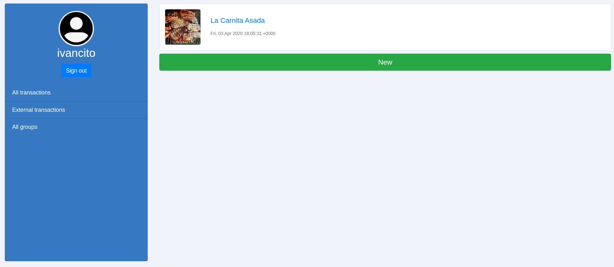

  
  

Group-transactions 
============

    

This project is aim to build  an app for grouping payments by goal with your family/friends.

You can create an account and start grouping payments with your friends. You can also register certain expenses that are not attached with an specific group.

## Built With

- Ruby: 2.6.5
- Rails: 5.2.4
- Postgres: >=9.6

## Live Version
[Group transactions](https://group-transactions.herokuapp.com/)

## Installation

### prerequisites

Get a local copy of the project cloning the[repository](https://github.com/fivan18/group-transactions):

    $ git colone https://github.com/fivan18/group-transactions.git

### install

Be sure to run `bundle` to install all necesary

    $ bundle install

Use the terminal and go inside the [project's](https://github.com/fivan18/group-transactions) root directory and run the next command

    $ rails db:migrate

Run the next command

    $ rails s

## Author

👤 **Ivan Ulises Guzman Sanchez**

- Github: [@fivan18](https://github.com/fivan18)
- Twitter: [@fivanunam](https://twitter.com/fivanunam)
- Linkedin: [fivan](https://www.linkedin.com/in/fivan)

## 🤝 Contributing

Contributions, issues and feature requests are welcome!

Feel free to check the [issues page](https://github.com/fivan18/group-transactions/issues).

## 📝 License

This project is [MIT]() licensed.